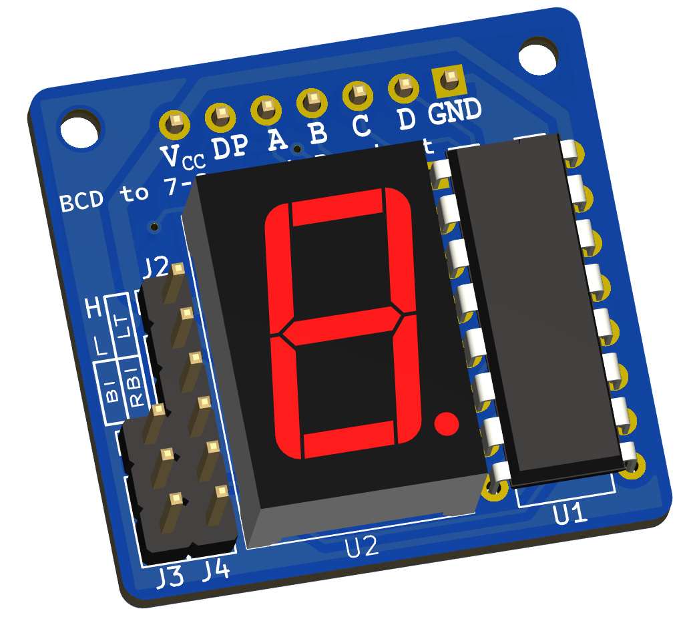

# 7-Segment Breakout Board

This is a KiCad project for a 7-segment display breakout board.

## Description

The 7-segment breakout board includes a 7-segment display and a 74LS47 Decoder/Driver. This board is a handy tool for building prototypes on a breadboard with these components. There's no need to wire all those connections and resistors manually, reducing the mess on the breadboard.

## PDF Schematic

The project is created in KiCad. If you need to check the schematic without using KiCad, the exported schematic can be found in the `schematic_pdf` directory.

## Test Code

A simple Arduino project for verifying that the board works properly can be found in the `tester` directory.

## Gerber Files

The files that can be sent to a PCB manufacturer can be found in the `fabrication_outputs` directory.
